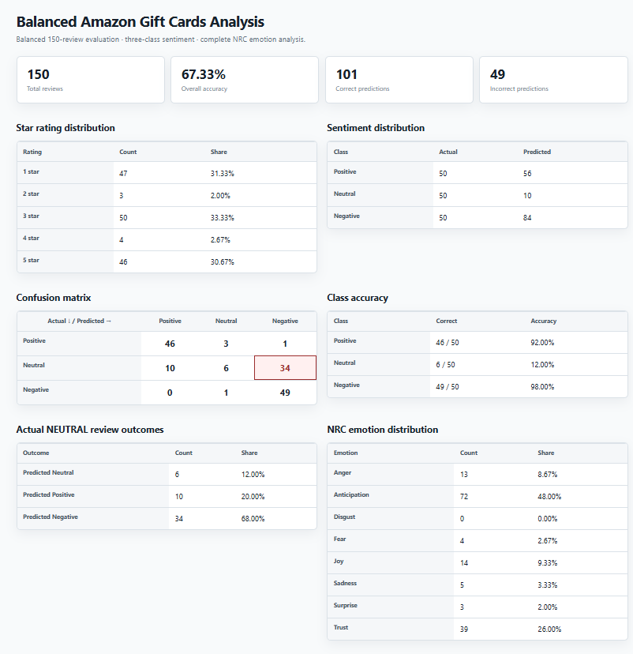
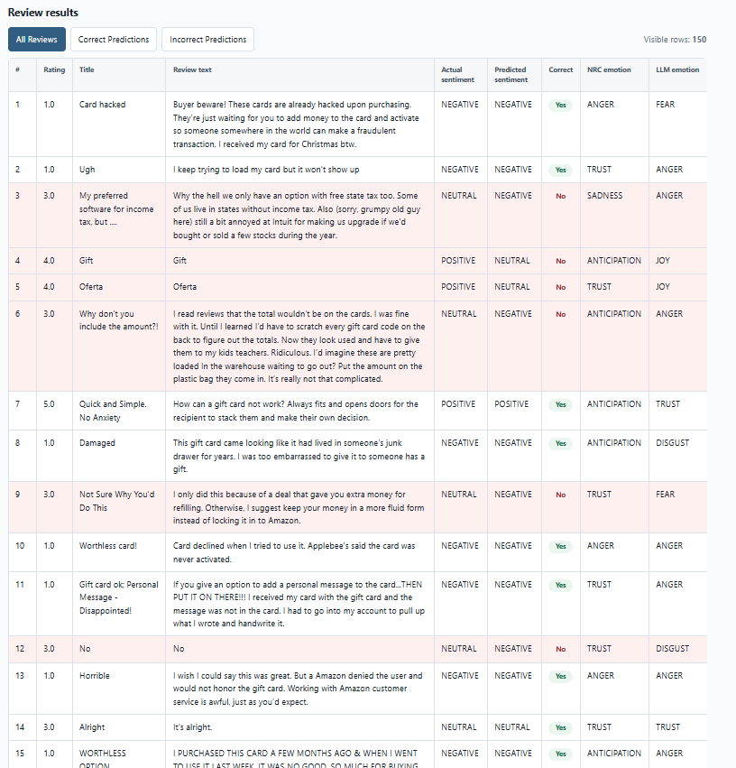

# Amazon Gift Cards Sentiment and Emotion Analytics

This MBAX 6418 project evaluates sentiment and primary emotion in the Amazon Reviews 2023 Gift Cards category. The workflow profiles the complete 152,410-review source file, creates a reproducible balanced sample, classifies review text with a rating-blind language model, compares model-assigned emotions with an NRC lexicon baseline, and presents the findings in a self-contained dashboard.

## Business question

Can a language model infer customer sentiment from review language alone, and does strong overall accuracy hold when positive, neutral, and negative reviews receive equal representation?

The model sees only the review title and text. Star ratings are withheld during inference and used afterward to create evaluation labels:

- Ratings 4–5: `POSITIVE`
- Rating 3: `NEUTRAL`
- Ratings 1–2: `NEGATIVE`

## Main finding

The original imbalanced sample produced 99.00% accuracy, but that result was misleading because the sample was dominated by positive reviews and did not adequately test performance across all sentiment classes. After balancing the sample, overall accuracy fell to 67.33%, even though the model still achieved 92.00% accuracy for POSITIVE reviews and 98.00% for NEGATIVE reviews. The main weakness was the NEUTRAL class, where accuracy was only 12.00%: 44 of 50 neutral reviews were misclassified, including 34 labeled as NEGATIVE and 10 labeled as POSITIVE. Balanced sampling therefore revealed that the model performs well when sentiment is clearly positive or negative but has substantial difficulty recognizing neutral language, a limitation that the original 99.00% accuracy concealed.

## Balanced three-class results

The experiment uses seed `6418` and samples 50 eligible reviews from each sentiment class after scanning the full dataset.

| Metric | Result |
|---|---:|
| Reviews | 150 |
| Correct predictions | 101 |
| Incorrect predictions | 49 |
| Overall accuracy | 67.33% |
| POSITIVE accuracy | 92.00% |
| NEUTRAL accuracy | 12.00% |
| NEGATIVE accuracy | 98.00% |

### Confusion matrix

Rows are rating-derived actual labels; columns are model predictions.

| Actual \ Predicted | POSITIVE | NEUTRAL | NEGATIVE |
|---|---:|---:|---:|
| POSITIVE | 46 | 3 | 1 |
| NEUTRAL | 10 | 6 | 34 |
| NEGATIVE | 0 | 1 | 49 |

The largest error is `NEUTRAL → NEGATIVE`, which occurred 34 times. Ratings are an evaluation proxy rather than definitive sentiment ground truth, so disagreement does not automatically mean the text-based prediction is unreasonable.

## Emotion analysis

Each balanced review receives one primary emotion from the language model and one from the NRC word-emotion lexicon. Both methods use `ANGER`, `ANTICIPATION`, `DISGUST`, `FEAR`, `JOY`, `SADNESS`, `SURPRISE`, and `TRUST`.

All 150 reviews have complete LLM and NRC emotion assignments. The methods agreed on 26 reviews, for an agreement rate of 17.33%. This measures consistency between two methods, not emotion accuracy; NRC is a deterministic lexical baseline that does not model context, negation, or sarcasm.

## Dashboard

Open [`reports/sentiment_dashboard.html`](reports/sentiment_dashboard.html) in a browser. It contains headline metrics, rating and sentiment distributions, a three-class confusion matrix, per-class accuracy, neutral-error detail, NRC emotion results, and review-level records.





## Data source

- Dataset: [Amazon Reviews 2023](https://amazon-reviews-2023.github.io)
- Category file: [Gift Cards review data](https://mcauleylab.ucsd.edu/public_datasets/data/amazon_2023/raw/review_categories/Gift_Cards.jsonl.gz)
- Citation: Hou et al. (2024), *Bridging Language and Items for Retrieval and Recommendation*, arXiv:2403.03952

Raw data and reviewer-level outputs are excluded from version control. Credentials are never stored in project source or result files.

## Project structure

```text
amazon-gift-cards/
├── config/                  # Reproducible model and analysis settings
├── prompts/                 # Versioned sentiment and emotion prompts
├── scripts/                 # Data preparation, classification, and dashboard entry points
├── src/gift_cards/          # Sampling, inference, scoring, and evaluation code
├── tests/                   # Offline unit and integration tests
├── data/
│   ├── raw/                 # Original source data; excluded from Git
│   └── processed/           # Samples and model results; excluded from Git
├── reports/                 # Dashboard, screenshots, and analytical reports
├── THREE_CLASS_METHOD.md
└── EMOTION_METHOD.md
```

## Reproduce the local analysis

```bash
uv venv --python 3.11.16 .venv
uv pip install --python .venv/Scripts/python.exe -r requirements-lock.txt
.venv/Scripts/python.exe -m unittest discover -s tests -v
.venv/Scripts/python.exe scripts/prepare_data.py
.venv/Scripts/python.exe scripts/create_balanced_sample.py
```

The sampling stage is deterministic. Hosted model outputs are preserved as the experiment record because fixed prompts and model settings do not guarantee identical future responses. Classification scripts require the approved Hermes-managed provider configuration and should not be rerun unless new model calls are intended.

## Limitations

- Star ratings are imperfect sentiment labels, especially for three-star reviews.
- The balanced evaluation covers 150 eligible reviews and is not a substitute for validation on the full dataset.
- Rating-leakage safeguards make the sample representative of eligible rating-blind reviews rather than every review.
- NRC emotion scoring can miss context, negation, sarcasm, and mixed emotions.
- Low cross-method agreement does not identify which method is correct; that would require human-labeled emotion ground truth.

See [`THREE_CLASS_METHOD.md`](THREE_CLASS_METHOD.md) and [`EMOTION_METHOD.md`](EMOTION_METHOD.md) for detailed methodology.
